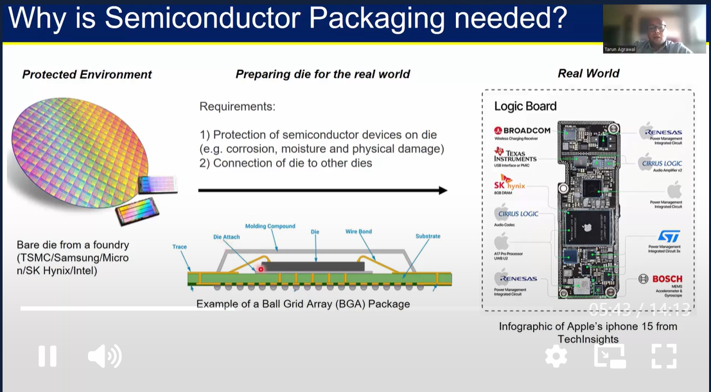
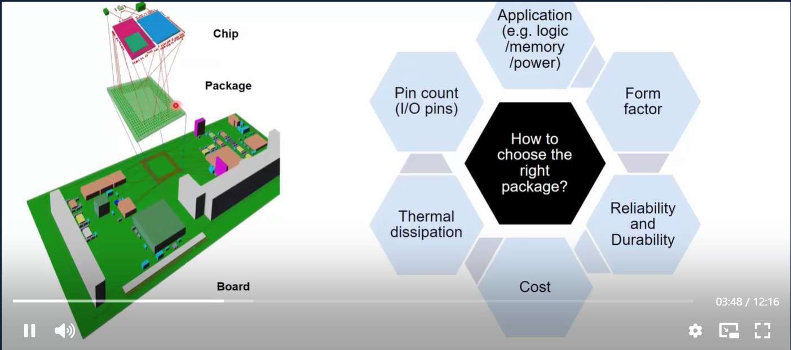
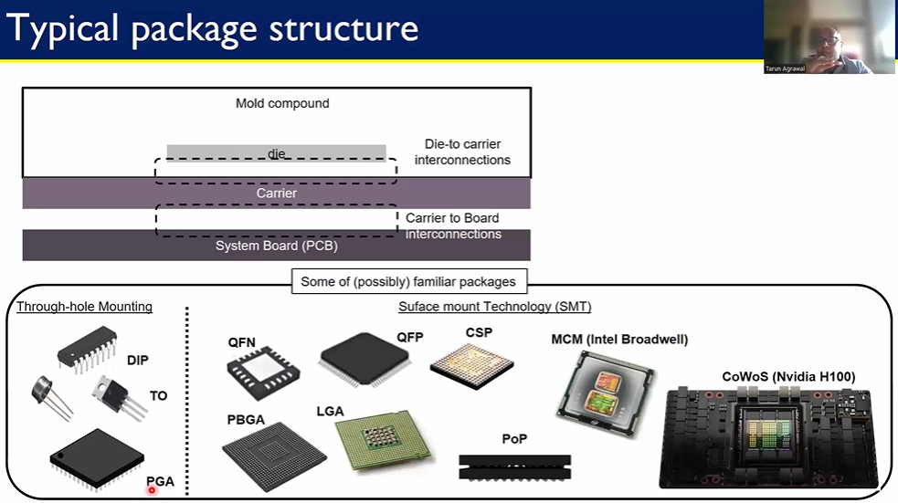
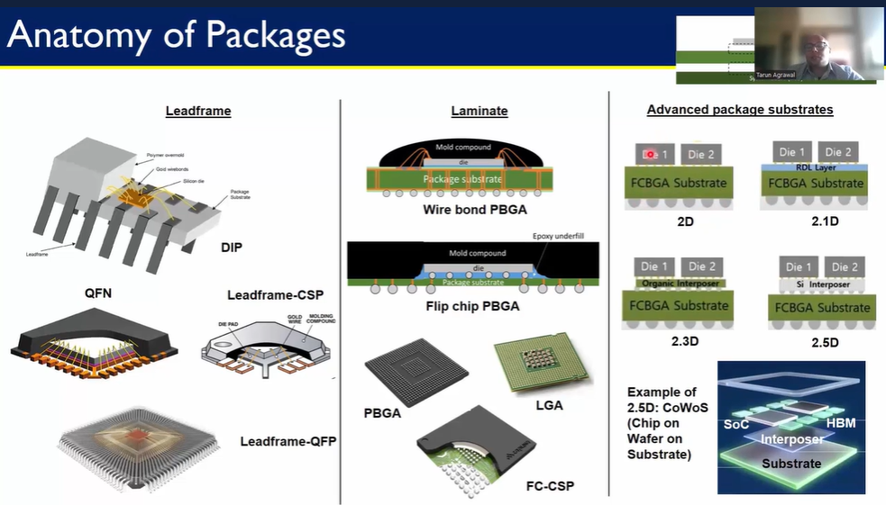

| Image | Description |
|-------|-------------|
|  | Semiconductor packaging is needed to protect the fragile bare die (from foundries like TSMC, Samsung, etc.) from corrosion, moisture, and physical damage, and to provide a means for connecting the die to other dies in the real world|  
|  | The major trade-offs for choosing right packagiong are : Application (e.g., logic/memory/power), Form factor, Reliability and Durability, Cost, Thermal dissipation, and Pin count (I/O pins).|
|  |**Through-hole Mounting:**  * DIP: Dual In-line Package  * TO: Transistor Outline  * PGA: Pin Grid Array  **Surface Mount Technology (SMT):**   * QFN: Quad Flat No-leads  * PBGA: Plastic  Ball Grid Array  * QFP: Quad Flat Package  * PoP: Package on Package  * MCM  : Multi-Chip Module    * CoWoS : Chip-on-Wafer-on-Substrate  |
|  | **2D:** Features one or more dies placed side-by-side on an FCBGA substrate, with interconnections primarily in the x-y plane.  **2.1D:** Similar to 2D but includes an RDL (Redistribution Layer). **2.3D:** Stacks multiple dies vertically on an FCBGA substrate, interconnected through the organic interposer. **2.5D:** Uses silicon interposer as an intermediary layer between the dies and the FCBGA substrate, enabling high-density vertical and horizontal interconnects. An example is CoWoS. |

 
